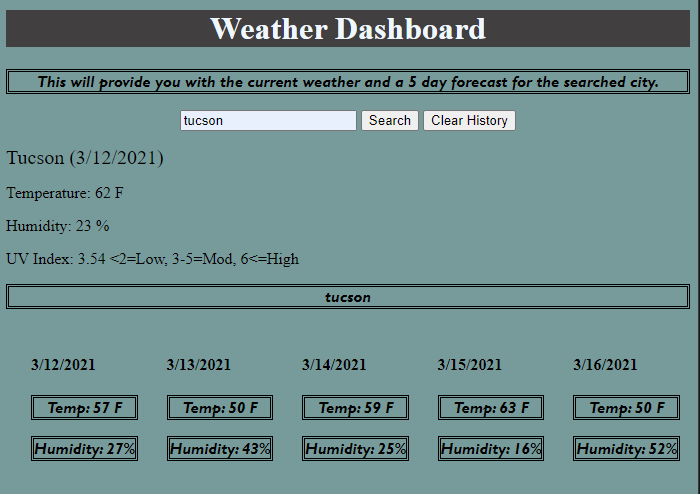

# myweatherapp

https://github.com/myrlaf25/myweatherapp

https://myrlaf25.github.io/myweatherapp/.

My goal with this weather dashboard is to allow the user to enter a city into the Search a City input box. Once the user clicks on the search button the app will show the current weather for the day along with a 5-day forecast. The app is also saving the information into localStorage and it is being displayed what cities have been searched. The clear history button once clicked will delete the information from the localStorage. I mainly used Vanilla Javascript and attempted to create some of the html elements dynamically. 

This is a photo of my webpage with the weather dashboard.

I am also using 2 Third-party APIs by accessing their data and functionality by making requests with specific parameters to a URL.  In this weather dashboard I am using 
Api.openweather.org -weather: This was used to pull the current weather along with latitude and longitude. 
[OpenWeather API](https://openweathermap.org/api)
-onecall: the latitude and longitude from the weather api were used in order to get access to more information provide by one call and pull the 5 day forecast. 

The 5-day forecast was used by using a For Loop since the information on the api was presented as an array. 
